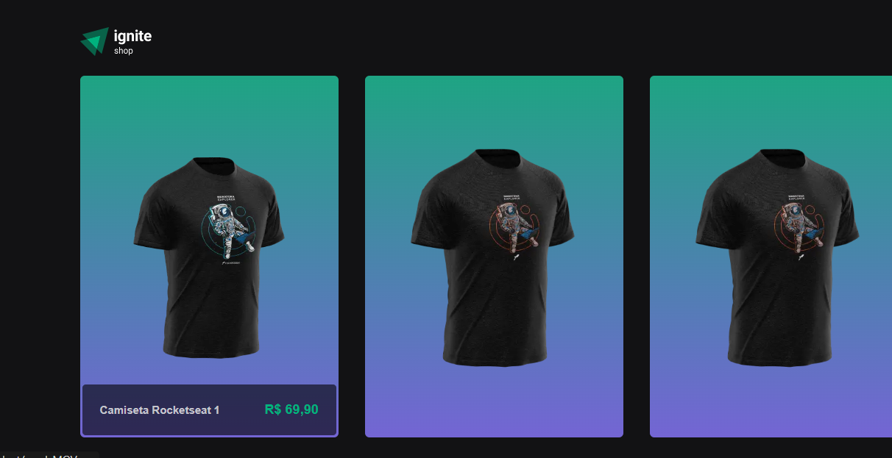

[](https://github.com/gutoo01/template-04-igniteShop/blob/main/readme.md)
[](https://github.com/gutoo01/template-04-igniteShop/blob/main/readme.pt-br.md)

# **Ignite Shop**



> Clothing store application with scrollable content visualization (carousel) and online payment integration.

#
### The project has reached the end of its tasks:

- [x] Export layout from figma application
- [x] Stylize using Stitches
- [x] Inserting carousel
- [x] Integrate Stripe Payments API
- [x] Format display of values
- [x] Create API routes
- [x] Configure checkout route in Stripe
- [x] Implement Buy button
- [x] Create purchase made page
- [x] Running SSG application
- [x] Defining SEO

#
## 💻 Prerequisites:

Before starting, check the following requirements:

- Requires versions:

```
"stripe": "^10.8.0",
"@stitches/react": "^1.2.8"
```

## 🚀 Installing **igniteShop**

To install **IgniteShop**, follow these steps:

Win, Linux and macOS:

```
npm i
or
yarn
```
to Run app:
```
npm run dev
or
yarn dev
```

#
## 🫱🏻‍🫲🏽 Instructors

Thanks to the following people who contributed to this project:

<table>
  <tr>
    <td align="center">
      <a href="#">
        <br>
        <sub>
          <b>Diego Fernandes</b>
        </sub>
      </a>
    </td>
    <td align="center">
      <a href="#">
        <br>
        <sub>
          <b>Mayk Brito</b>
        </sub>
      </a>
    </td>
    <td align="center">
      <a href="#">
        <br>
        <sub>
          <b>Jakeliny Gracielly</b>
        </sub>
      </a>
    </td>
  </tr>
</table>

[⬆ Back to top](#project-name)<br>
